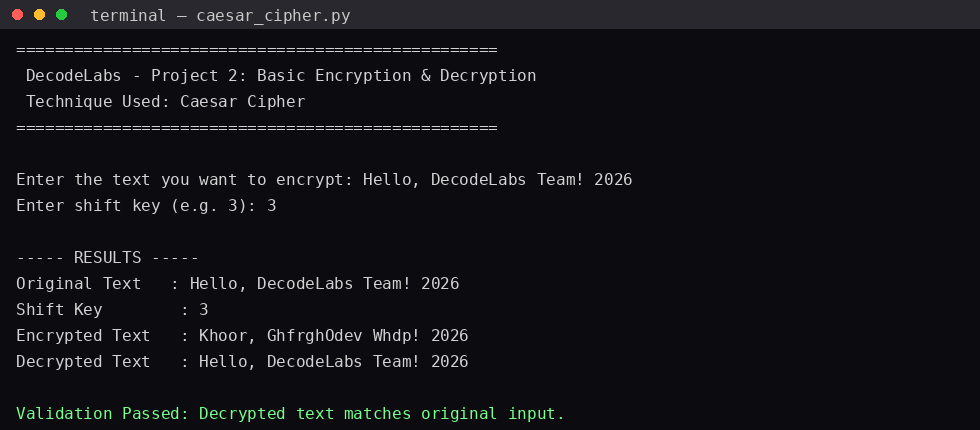

# 🔐 DecodeLabs – Industrial Training Kit (Batch 2026)
## Project 2: Basic Encryption & Decryption (Caesar Cipher)


---

## 📌 Overview

This project was completed as part of the **DecodeLabs Industrial Training Kit – Cyber Security Track**.
The goal of **Project 2** is to understand and implement the fundamental mechanics of **Data Confidentiality** through a simple, reversible encryption/decryption system using the **Caesar Cipher**.

> *"This track isn't about cracking codes — it's about Data Confidentiality."* – DecodeLabs

---

## 🎯 Goal

Implement a simple encryption and decryption technique that:
- Encrypts user-provided text using a basic Caesar Cipher logic
- Decrypts the encrypted text back to its original form
- Displays both the encrypted and decrypted output
- Validates that decryption correctly reverses encryption

---

## 🧠 Concept: The IPO Model

| Stage | Description |
|---|---|
| **Input** | Plaintext (raw user text) |
| **Process** | Algorithm (Caesar Shift) + Key (shift value `n`) |
| **Output** | Ciphertext (secured/obfuscated text) |

### Core Formulas

**Encryption:**
```
E_n(x) = (x + n) % 26
```

**Decryption:**
```
D_n(x) = (x - n) % 26
```

Where:
- `x` = character position (0–25, derived from ASCII)
- `n` = shift key

Since the **same key both locks and unlocks** the message, this is a form of **Symmetric Encryption**.

---

## ⚙️ How It Works (Algorithm Flow)

```
Char 'A' → ASCII Conversion (65) → Subtract Base (-65 → 0)
        → Add Key (+3 → 3) → Modulo (%26 → 3)
        → Add Base (+65 → 68) → Char 'D'
```

Implemented in Python using:
- `ord()` → Converts a character to its integer (ASCII) value
- `chr()` → Converts an integer back into a character
- `%` (modulo) → Handles wrap-around for the finite 26-letter alphabet

```python
cipher_char = chr((ord(char) - 65 + shift) % 26 + 65)
```

---

## 🛠️ Features Implemented

- ✅ Encrypts user text using Caesar Cipher logic
- ✅ Decrypts ciphertext back to original plaintext
- ✅ Displays both encrypted and decrypted output side-by-side
- ✅ Custom **user-defined shift key** (not hardcoded — extension suggested in project brief)
- ✅ Handles **edge cases**: spaces, numbers, and punctuation are passed through unchanged
- ✅ Supports both **uppercase and lowercase** letters independently
- ✅ Built-in **validation check** confirming `decrypt(encrypt(x)) == x`

---

## 📂 Project Structure

```
project-2-caesar-cipher/
│
├── caesar_cipher.py                 # Main program (encryption + decryption logic)
├── terminal_output_screenshot.png   # Sample run output
└── README.md                        # This report
```

---

## ▶️ How to Run

```bash
python3 caesar_cipher.py
```

You will be prompted to:
1. Enter the text you want to encrypt
2. Enter a shift key (e.g. `3`)

The program will then display the **original**, **encrypted**, and **decrypted** text, along with a validation result.

---

## 🖥️ Sample Output

**Input:**
```
Text  : Hello, DecodeLabs Team! 2026
Shift : 3
```

**Output:**
```
==================================================
 DecodeLabs - Project 2: Basic Encryption & Decryption
 Technique Used: Caesar Cipher
==================================================

----- RESULTS -----
Original Text   : Hello, DecodeLabs Team! 2026
Shift Key       : 3
Encrypted Text  : Khoor, GhfrghOdev Whdp! 2026
Decrypted Text  : Hello, DecodeLabs Team! 2026

✅ Validation Passed: Decrypted text matches original input.
```

📸 **Terminal Screenshot:**



---

## 🔍 Security Note (Why Caesar Cipher Is a Lockbox, Not a Vault)

As covered in the training material, the Caesar Cipher is excellent for **learning cryptographic logic**, but it is **not secure** for real-world use because:

1. **Tiny Key Space** – Only 25 possible keys → trivially brute-forceable instantly.
2. **Pattern Preservation** – Letter frequency distribution is preserved, making it vulnerable to **frequency analysis**.

This is why modern systems evolve toward stronger algorithms like **AES-256**, which use confusion, diffusion, and much larger key spaces (128-bit+) instead of a simple shift.

---

## 🚀 Possible Extensions (Future Work)

- [ ] Implement a **Vigenère Cipher** (multi-character key, harder to break via frequency analysis)
- [ ] Add a **brute-force decryption demo** to visually show the Caesar Cipher's weakness
- [ ] Build a simple **GUI / web interface** for the encryptor-decryptor
- [ ] Add **frequency analysis visualization** of ciphertext vs plaintext

---

## 🧰 Tech Stack

- **Language:** Python 3
- **Concepts:** ASCII/Unicode mapping, modular arithmetic, string manipulation

---

## 👤 Author

Industrial Training Intern – DecodeLabs (Batch 2026)

---

## 🏢 About DecodeLabs

📞 +91 89330 06408
✉️ decodelabs.tech@gmail.com
🌐 www.decodelabs.tech
📍 Greater Lucknow, India
